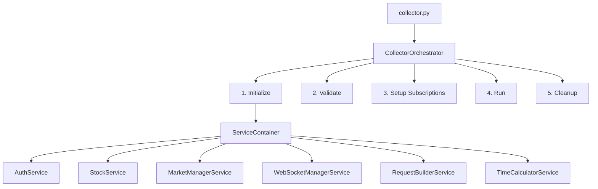

# Finance City Collector

KIS API를 통해 한국(KRX)과 미국(NASDAQ/NYSE/AMEX) 시장의 실시간 주가 데이터를 수집하는 모듈식 데이터 수집기입니다.

## 프로젝트 구조

```
src/
├── collector.py             # 메인 진입점
├── core/                    # 핵심 컴포넌트  
│   ├── __init__.py         # DI 컨테이너 및 코어 익스포트
│   ├── models.py           # 데이터 모델 (StockInfo, MarketData 등)
│   ├── interfaces.py       # 서비스 인터페이스 정의
│   ├── exceptions.py       # 커스텀 예외 클래스
│   ├── service_container.py # 의존성 주입 컨테이너
│   └── README.md
├── config/                  # 설정 관리
│   ├── __init__.py         # 설정 모듈 익스포트  
│   ├── base_config.py      # 기본 설정 및 환경별 구성
│   ├── trading_config.py   # 거래 관련 설정 (시장, 거래소 등)
│   └── README.md
├── orchestrator/            # 오케스트레이션
│   ├── __init__.py
│   ├── collector_orchestrator.py # 수집 프로세스 통합 관리
│   └── README.md
├── markets/                 # 시장별 구현
│   ├── __init__.py         
│   ├── base.py            # 베이스 마켓 프로바이더
│   ├── krx.py             # KRX (KOSPI/KOSDAQ)
│   ├── us.py              # US Markets (NASDAQ/NYSE/AMEX)
│   └── README.md
├── services/                # 비즈니스 로직 서비스
│   ├── __init__.py
│   ├── auth_service.py     # KIS API 인증 관리
│   ├── stock_service.py    # 종목 관리
│   ├── market_manager_service.py    # 시장 관리 서비스
│   ├── websocket_manager_service.py # WebSocket 관리 서비스
│   ├── request_builder.py  # API 요청 빌더
│   ├── time_calculator.py  # 시간/세션 계산
│   └── README.md
└── data/                    # 데이터 처리
    ├── __init__.py
    ├── parser.py          # KIS 데이터 파싱
    ├── websocket_client.py # WebSocket 실시간 통신
    └── README.md

```

## 아키텍처 설계

### 핵심 설계 원칙

1. **의존성 주입(DI)**: ServiceContainer를 통한 중앙집중식 의존성 관리
2. **인터페이스 기반**: 모든 서비스는 인터페이스를 통한 상호작용  
3. **오케스트레이션**: CollectorOrchestrator가 전체 프로세스 통합 관리
4. **단일 책임**: 각 모듈은 명확한 단일 책임을 가짐
5. **타입 안전성**: 완전한 타입 힌트와 Enum 활용
6. **확장성**: 새로운 시장 추가 시 기존 코드 수정 최소화

### 실행 흐름



### 모듈별 역할

| 모듈 | 역할 | 핵심 컴포넌트 |
|------|------|---------------|
| **core** | 인터페이스, 모델, DI 컨테이너 | `ServiceContainer`, `IMarketProvider`, `StockInfo` |
| **config** | 설정 중앙화 | `AppConfig`, `TradingConfig`, `MarketConfig` |
| **orchestrator** | 프로세스 통합 관리 | `CollectorOrchestrator` |
| **markets** | 시장별 특화 기능 | `KRXMarketProvider`, `USMarketProvider` |
| **services** | 비즈니스 로직 | `AuthService`, `StockService`, `RequestBuilderService` |
| **data** | 데이터 처리/통신 | `KISDataParser`, `KISWebSocketClient` |

## 개발 현황

### 완료된 구현

**Core Infrastructure**
- 의존성 주입 컨테이너 (`ServiceContainer`)
- 인터페이스 기반 아키텍처 (`core/interfaces.py`)
- 데이터 모델 정의 (`core/models.py`)
- 커스텀 예외 체계 (`core/exceptions.py`)

**Configuration Management**  
- 환경별 설정 관리 (`AppConfig`)
- 거래 설정 중앙화 (`TradingConfig`)
- 시장별 설정 (`MarketConfig`)

**Orchestration**
- 통합 프로세스 관리 (`CollectorOrchestrator`)
- 단계별 실행 흐름 구현
- 에러 핸들링 및 정리 프로세스

**Market Providers**
- KRX 시장 구현 (KOSPI/KOSDAQ)
- US 시장 구현 (NASDAQ/NYSE/AMEX)
- 시장별 세션 및 필드 설정

**Services Layer**
- KIS API 인증 서비스 (토큰 캐싱 포함)
- 종목 관리 서비스
- 시장 관리 서비스 (MarketManagerService)
- WebSocket 관리 서비스 (WebSocketManagerService)
- API 요청 빌더 서비스
- 시간 계산 서비스

**Data Processing**
- WebSocket 실시간 클라이언트
- KIS 데이터 파서
- 비동기 메시지 처리

### 현재 구현 상태

| 모듈 | 구현 완료도 | 설명 |
|------|-------------|------|
| **core** | 완료 | 의존성 주입, 인터페이스, 데이터 모델 |
| **config** | 완료 | 환경별 설정, 거래 설정 |
| **orchestrator** | 완료 | 전체 프로세스 관리 |
| **services** | 완료 | 인증, 종목 관리, WebSocket 서비스 |
| **markets** | 완료 | KRX, US 시장 구현 |
| **data** | 완료 | 데이터 파싱, WebSocket 클라이언트 |

### 개선 사항

**향후 보완 필요한 영역**
- 테스트 커버리지 확대
- 로깅 시스템 표준화
- 성능 모니터링 메트릭 추가
- 문서 자동 생성 도구

**운영 고려사항**
- Redis는 선택적 사용 (fallback 로직 있음)
- CSV 파일 기반 종목 관리 (동적 관리 고려)
- WebSocket 재연결 로직 구현됨

## 개발 환경 설정

### 1. 의존성 설치

```bash
pip install -r requirements.txt
```

### 2. 환경변수 설정

`.env` 파일을 생성하고 다음 정보를 입력:

```bash
# KIS API 설정
KIS_APP_KEY=your_app_key_here
KIS_APP_SECRET=your_app_secret_here
KIS_API_BASE_URL=https://openapi.koreainvestment.com:9443
KIS_WS_URL=ws://ops.koreainvestment.com:21000

# Redis 설정
REDIS_HOST=localhost
REDIS_PORT=6379
REDIS_CHANNEL=stock:realtime

# 환경 설정
ENVIRONMENT=development
DEBUG=false
REVOKE_TOKEN_ON_EXIT=false
```

### 3. 종목 파일 설정

`stocks.csv` 파일을 생성하고 수집할 종목을 설정:

```csv
code,name,market,status,exchange
005930,삼성전자,KRX,active,
000660,SK하이닉스,KRX,active,
AAPL,Apple Inc.,US,active,NASDAQ
MSFT,Microsoft Corporation,US,active,NASDAQ
```

## 빠른 시작

### 실행 예시

```python
# 1. 편의 함수를 사용한 간단한 실행
from orchestrator import run_collector

if __name__ == "__main__":
    exit_code = run_collector()
    sys.exit(exit_code)

# 2. 상세 제어가 필요한 경우
from orchestrator import CollectorOrchestrator
from config import get_app_config

def main():
    try:
        config = get_app_config()
        orchestrator = CollectorOrchestrator(config)
        
        # 단계별 실행
        if not orchestrator.initialize():
            return 1
        if not orchestrator.validate():
            return 1
        if not orchestrator.setup_subscriptions():
            return 1
        
        # 실행 (비동기 블로킹)
        orchestrator.run()
        
        return 0
    except Exception as e:
        logging.error(f"실행 오류: {e}")
        return 1
    finally:
        orchestrator.cleanup()
```

### 직접 실행

```bash
# 메인 스크립트 실행
python3 collector.py
```

## 성능 및 모니터링

### 메트릭 수집

- **처리량**: 초당 처리 메시지 수
- **레이턴시**: 데이터 수신부터 처리까지의 지연시간
- **에러율**: 처리 실패 비율
- **연결 안정성**: WebSocket 연결 유지 시간

### 로깅

```python
import logging

# 모듈별 로거 설정
logger = logging.getLogger(__name__)
logger.info("데이터 수집 시작")
logger.error("API 호출 실패", extra={"stock_code": "005930"})
```

## 확장 가이드

### 새로운 시장 추가

1. `markets/` 디렉토리에 새 시장 구현체 생성
2. `IMarketProvider` 인터페이스 구현
3. `config/trading_config.py`에 시장 설정 추가
4. 테스트 코드 작성

### 새로운 데이터 소스 추가

1. `data/` 디렉토리에 새 파서/클라이언트 생성
2. 관련 인터페이스 구현
3. 서비스 레이어와 통합
4. 설정에 새 데이터 소스 등록

## 문서 링크

- [전체 아키텍처](../ARCHITECTURE_V1.md) - v1.0 아키텍처 상세 분석
- [사용법 가이드](../USAGE.md) - 수집기 사용 방법
- [API 문서](https://apiportal.koreainvestment.com/) - KIS Open API 명세
- [개발 가이드](../docs/development.md) - 개발 환경 구축

## 문제 해결

### 일반적인 문제들

1. **인증 실패**: KIS API 키 확인
2. **WebSocket 연결 실패**: 방화벽 및 네트워크 확인
3. **Redis 연결 실패**: Redis 서버 상태 확인
4. **종목 로딩 실패**: `stocks.csv` 파일 형식 확인

### 디버깅

```python
# 로깅 레벨 설정
import logging
logging.basicConfig(level=logging.DEBUG)

# 상세 에러 정보
try:
    # 작업 수행
    pass
except Exception as e:
    logger.error(f"오류 발생: {e}", exc_info=True)
```

---

**현재 버전**: v2.0 (모듈식 아키텍처)  
**마지막 업데이트**: 2026-01-24
