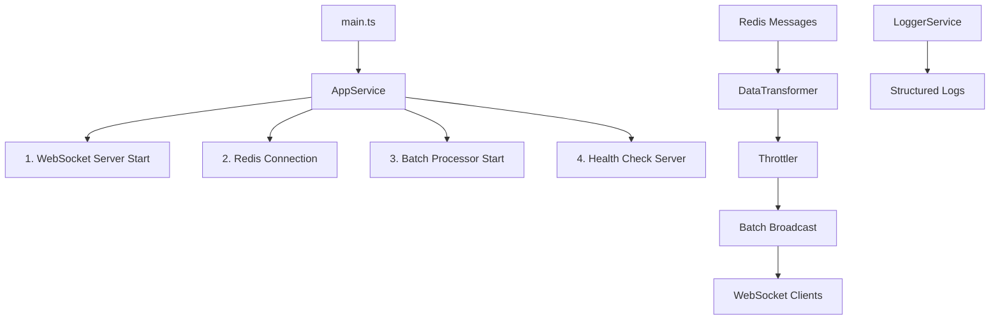
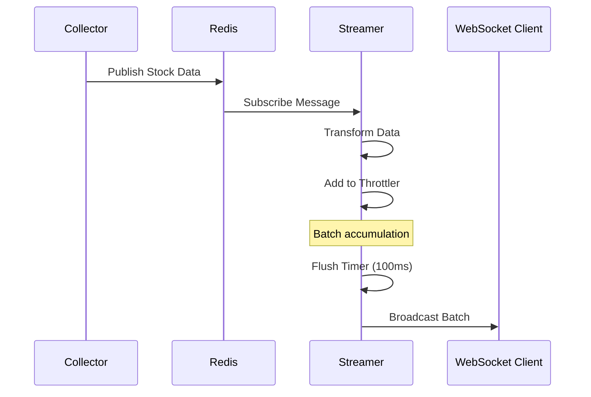

# Finance City Streamer

Redis를 통해 실시간 주식 데이터를 수신하고 WebSocket으로 클라이언트에게 배치 단위로 브로드캐스트하는 모듈식 스트리밍 서버입니다.

## 프로젝트 구조

```
src/
├── main.ts                  # 메인 진입점
├── services/                # 비즈니스 로직 서비스
│   ├── app.service.ts      # 애플리케이션 오케스트레이션
│   ├── logger.service.ts   # 구조화된 로깅
│   └── data-transformer.service.ts # 데이터 변환
├── adapters/                # 외부 시스템 연동
│   ├── redis-broker.ts     # Redis 연결 및 구독
│   └── websocket-server.ts # WebSocket 서버
├── domain/                  # 도메인 로직
│   └── throttler.ts        # 배치 처리 및 병합
├── config/                  # 설정 관리
│   └── app.config.ts       # 환경변수 기반 설정
└── types/                   # TypeScript 타입 정의
    ├── config.types.ts     # 설정 관련 타입
    ├── domain.types.ts     # 도메인 모델
    ├── adapters.types.ts   # 어댑터 인터페이스
    └── index.ts            # 타입 익스포트
```

## 아키텍처 설계

### 핵심 설계 원칙

1. **관심사 분리**: Services, Adapters, Domain, Config, Types로 계층 분리
2. **단일 책임**: 각 서비스는 명확한 단일 책임
3. **배치 최적화**: 실시간 데이터를 배치로 병합하여 효율성 향상
4. **타입 안전성**: TypeScript 타입 정의 활용
5. **환경 설정**: 환경변수를 통한 런타임 설정

### 실행 흐름



### 데이터 흐름



### 모듈별 역할

| 모듈 | 역할 | 핵심 컴포넌트 |
|------|------|---------------|
| **services** | 비즈니스 로직 및 오케스트레이션 | `AppService`, `LoggerService`, `DataTransformerService` |
| **adapters** | 외부 시스템 연동 | `RedisBroker`, `WebSocketServer` |
| **domain** | 핵심 도메인 로직 | `Throttler` (배치 처리) |
| **config** | 설정 중앙화 | `loadConfig` |
| **types** | 타입 정의 | `AppConfig`, `ClientStockData`, 인터페이스 |

## 개발 현황

### 완료된 구현

**Core Services**
- 애플리케이션 오케스트레이션 (`AppService`)
- 구조화된 로깅 시스템 (`LoggerService`)
- 실시간 데이터 변환 (`DataTransformerService`)

**External Adapters**
- Redis 구독 및 연결 관리 (`RedisBroker`)
- WebSocket 서버 및 클라이언트 관리 (`WebSocketServer`)

**Domain Logic**
- 배치 처리 및 데이터 병합 (`Throttler`)
- 종목별 데이터 누적 및 최적화

**Configuration**
- 환경변수 기반 설정 관리
- 배치 주기 환경변수 제어 (`FLUSH_INTERVAL_MS`)
- 타입 안전한 설정 로딩

**Infrastructure**
- Docker 컨테이너 지원
- Health Check HTTP 서버
- Graceful Shutdown 처리

### 현재 구현 상태

| 모듈 | 구현 상태 | 설명 |
|------|----------|------|
| **services** | 구현됨 | 앱 오케스트레이션, 로깅, 데이터 변환 |
| **adapters** | 구현됨 | Redis 브로커, WebSocket 서버 |
| **domain** | 구현됨 | 배치 처리 및 병합 로직 |
| **config** | 구현됨 | 환경변수 기반 설정 |
| **types** | 구현됨 | TypeScript 타입 정의 |

### 배치 처리 최적화

**Throttler 핵심 기능**
```typescript
// 종목별 데이터 병합
existing.p = data.p;        // 가격: 최신값으로 덮어쓰기
existing.r = data.r;        // 등락률: 최신값으로 덮어쓰기
existing.vl = data.vl;      // 누적거래량: 최신값으로 덮어쓰기
existing.vt += data.vt;     // 순간 체결량: 누적
```

**성능 최적화**
- 100ms 기본 배치 주기 (환경변수로 조정 가능)
- 종목별 데이터 병합으로 중복 제거
- Map 기반 메모리 버퍼링

### 로깅 시스템

**구조화된 로그 형식**
```json
{
  "timestamp": "2026-01-30T09:24:00.098Z",
  "level": 2,
  "message": "Batch broadcasted",
  "context": "AppService",
  "metadata": {
    "stock_count": 1,
    "stocks": "MSFT"
  }
}
```

**로그 레벨별 분류**
- `stock()`: 주식 데이터 수신/브로드캐스트
- `health()`: 시스템 상태 정보
- `info()`: 일반 정보
- `error()`: 오류 정보

## 개발 환경 설정

### 1. 의존성 설치

```bash
npm install
```

### 2. 환경변수 설정

`.env` 파일을 생성하고 다음 정보를 입력:

```bash
# Redis 설정
REDIS_HOST=localhost
REDIS_PORT=6379
REDIS_CHANNEL=stock:realtime

# 스트리밍 서버 설정
WS_PORT=8081
HEALTH_PORT=8082
MAX_CONNECTIONS=1000

# 배치 처리 설정
FLUSH_INTERVAL_MS=100        # 배치 주기 (밀리초)
# MAX_BATCH_SIZE=1000        # 최대 배치 크기 (선택사항)
# BATCH_TIMEOUT_MS=500       # 배치 타임아웃 (선택사항)

# 로깅 설정
LOG_LEVEL=info
NODE_ENV=development
```

### 3. TypeScript 빌드

```bash
npm run build
```

## 빠른 시작

### 개발 모드 실행

```bash
npm run dev
```

### 프로덕션 실행

```bash
npm start
```

### Docker 실행

```bash
# 개발환경
docker-compose up

# 프로덕션환경
docker-compose -f docker-compose.prod.yml up
```

## 성능 및 모니터링

### Health Check

HTTP Health Check 서버가 기본 포트 8082에서 실행됩니다:

```bash
curl http://localhost:8082/health
```

**응답 예시:**
```json
{
  "status": "healthy",
  "uptime_ms": 123456,
  "services": {
    "websocket": true,
    "redis": true,
    "throttler": true
  },
  "stats": {
    "throttler": { "pending": 0, "flushed": 0 },
    "websocket_clients": 5
  }
}
```

### 메트릭 수집

- **처리량**: 초당 배치 브로드캐스트 수
- **레이턴시**: Redis 수신부터 WebSocket 전송까지의 지연시간
- **배치 효율성**: 배치당 평균 종목 수
- **클라이언트 연결**: 동시 WebSocket 연결 수

### 성능 튜닝

**배치 주기 조정**
```bash
# 빠른 업데이트 (고성능 환경)
FLUSH_INTERVAL_MS=50

# 표준 설정 (개발환경)
FLUSH_INTERVAL_MS=100

# 서버 부하 감소 (고부하시)
FLUSH_INTERVAL_MS=200
```

### 확장 가이드

### 새로운 데이터 변환 추가

1. `DataTransformerService`에 새 변환 메서드 추가
2. `types/domain.types.ts`에 필요시 새 타입 정의
3. `Throttler`에서 새 데이터 필드 처리 로직 추가

### 새로운 브로드캐스트 채널 추가

1. `WebSocketServer`에 새 이벤트 타입 추가
2. `AppService`에서 새 데이터 흐름 구현
3. 클라이언트 타입 정의 업데이트

### 외부 시스템 연동

1. `adapters/` 디렉토리에 새 어댑터 생성
2. 필요시 인터페이스 정의 (`types/adapters.types.ts`)
3. `AppService`에 통합

## WebSocket 클라이언트 사용법

### 연결 및 구독

```javascript
const ws = new WebSocket('ws://localhost:8081');

ws.onmessage = (event) => {
  const message = JSON.parse(event.data);
  
  if (message.type === 'batch_stock_data') {
    const stocks = message.data; // Array of stock data
    
    stocks.forEach(stock => {
      console.log(`${stock.c}: $${stock.p} (${stock.r}%)`);
    });
  }
};
```

### 데이터 형식

**배치 데이터 구조:**
```typescript
interface ClientStockData {
  c: string;    // 종목코드
  p: number;    // 현재가
  r: number;    // 등락률
  vt: number;   // 체결량 (누적)
  vl: number;   // 누적거래량
  t?: number;   // 타임스탬프
}
```

## Docker 지원

### Dockerfile 특징

- Multi-stage 빌드로 이미지 크기 최적화
- Non-root 사용자 사용
- Health Check 포함
- 환경변수 기반 설정

### Docker Compose 통합

```yaml
services:
  streamer:
    build: ./streamer
    environment:
      - FLUSH_INTERVAL_MS=100
      - REDIS_HOST=redis
    healthcheck:
      test: ["CMD", "curl", "-f", "http://localhost:8082/health"]
      interval: 30s
      timeout: 10s
      retries: 3
```

## 문제 해결

### 일반적인 문제들

1. **Redis 연결 실패**: Redis 서버 상태 및 네트워크 확인
2. **WebSocket 연결 제한**: `MAX_CONNECTIONS` 환경변수 조정
3. **배치 지연**: `FLUSH_INTERVAL_MS` 값 확인
4. **메모리 사용량 증가**: 배치 크기 및 빈도 조정

### 디버깅

```bash
# 상세 로그 활성화
LOG_LEVEL=debug

# Health Check 상태 확인
curl http://localhost:8082/health

# 컨테이너 로그 확인
docker-compose logs -f streamer
```

### 성능 문제 해결

```typescript
// 배치 통계 확인
const stats = {
  batchSize: batchData.length,
  interval: this.config.throttler.flushIntervalMs,
  throughput: batchData.length / (this.config.throttler.flushIntervalMs / 1000)
};
```

---

**현재 버전**: v2.0 (모듈식 아키텍처)  
**마지막 업데이트**: 2026-01-30

